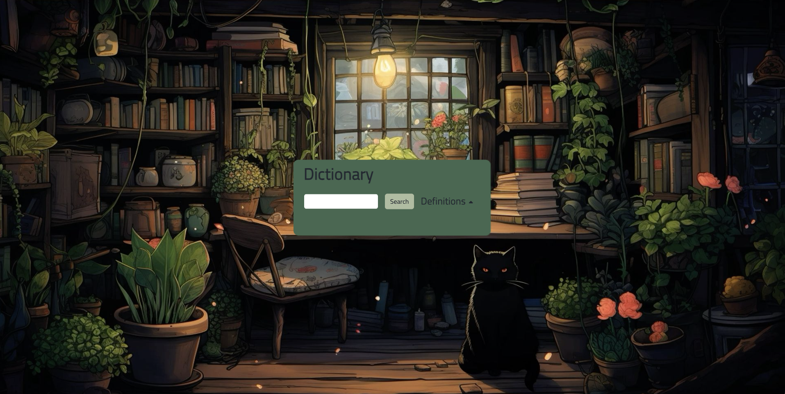

 
  
  &#xa0;

<h1 align="center">Api Word Dict</h1>

  

  

  

  

  <a href="#dart-about">About</a> &#xa0; | &#xa0; 
  <a href="#sparkles-features">Features</a> &#xa0; | &#xa0;
  <a href="#rocket-technologies">Technologies</a> &#xa0; | &#xa0;
  <a href="#memo-license">License</a> &#xa0; | &#xa0;
  <a href="https://github.com/r00kieAd" target="_blank">Author</a>

 

## :dart: About ##

Hi, I created this dictionary website for my self learning. This website gives users the ability to search for a word's definitions, synonyms, antonyms and examples. The results are fetched via an api called WordsAPI. The main div expands and retracts according to contents on the result section. A dropdown is provided to switch between the search modes. 

## :sparkles: Features ##

:heavy_check_mark: Dynamic;\
:heavy_check_mark: Responsive;\
:heavy_check_mark: Scalable;

## :rocket: Technologies ##

The following tools were used in this project:

- [HTML5](https://www.w3schools.com/html/default.asp)
- [CSS3](https://www.w3schools.com/css/default.asp)
- [JQuery](https://www.w3schools.com/jquery/default.asp)
- [JavaScript](https://www.w3schools.com/js/default.asp)
- [WordsAPI](https://rapidapi.com/dpventures/api/wordsapi/)
- [Visual Studio Code](https://code.visualstudio.com/)

## :memo: License ##

This project is under license from MIT. For more details, see the [LICENSE](LICENSE) file.

Coded by <a href="https://github.com/r00kieAd" target="_blank">Adhyatma Dwivedi</a>

&#xa0;

<a href="#top">Back to top</a>
